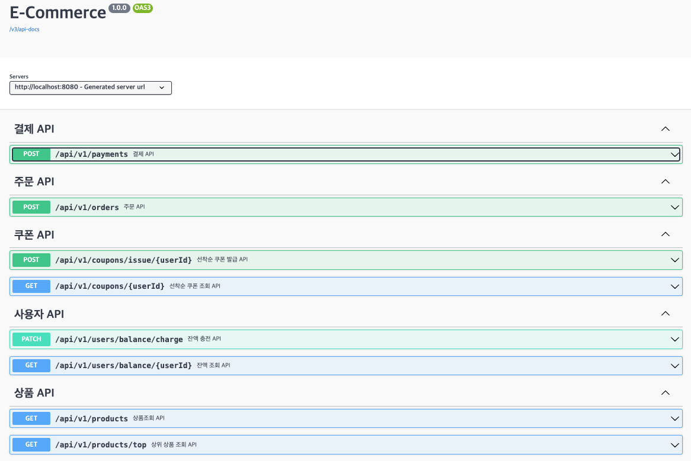

# E-Commerce API Specs

---
## MockAPI
`Swagger`: http://localhost:8080/swagger-ui/index.html



## API 명세
### 1️⃣ 잔액 조회 API
- Endpoint: `GET` /api/v1/users/balance/{userId}
- Summary: 사용자의 잔액을 조회한다.
- Parameter:
    - `userId` 사용자 고유 식별자
- ResponseBody:
    - `200` OK
        - `userId`: 사용자 고유 식별자
        - `balance`: 포인트 잔액
  ```json
  {
    "userId": "long",
    "balance": "long"
  }
  ```
- Example:
    - Response:
      ```json
      {
        "userId": 1,
        "balance": 1000000
      }
      ```
### 2️⃣ 잔액 충전 API
- Endpoint: `PATCH` /api/v1/users/balance/charge
- Summary: 사용자의 잔액을 충전한다.
- RequestBody:
    - `userId`: 사용자 고유 식별자
    - `amount`: 충전할 금액
  ```json
  {
    "userId": "long",
    "amount": "long"
  }
  ```
- ResponseBody:
    - `200` OK
        - `userId`: 사용자 고유 식별자
        - `userName`: 사용자 이름
        - `point`: 포인트 잔액
  ```json
  {
    "userId": "long",
    "point": "long"
  }
  ```
- Example:
    - Request:
      ```json
      {
        "userId": 1,
        "balance": 1000000
      }
      ``` 
    - Response:
      ```json
      {
         "userId": 1,
         "balance": 1000000
      }
      ```
### 3️⃣ 상품 목록 조회 API
- Endpoint: `GET` /api/v1/products
- Summary: 상품 목록을 조회한다.
- ResponseBody:
    - `200` OK
        - `id`: 상품 고유 식별자
        - `productName`: 상품명
        - `productPrice`: 상품가격
        - `stock`: 재고 수량
  ```json
  [
    {
      "id": "long",
      "productName": "string",
      "productPrice": "int",
      "stock": "int"
    }
  ]
  ```
- Example:
  - Response:
    ```json
    [
      {
        "id": 1,
        "productName": "후드티",
        "productPrice": 20000,
        "stock": 100
      },
      {
        "id": 2,
        "productName": "구스타운 패딩",
        "productPrice": 500000,
        "stock": 150
      },
      {
        "id": 3,
        "productName": "맥코트",
        "productPrice": 600000,
        "stock": 100
      },
      {
        "id": 4,
        "productName": "코듀로이 팬츠",
        "productPrice": 35000,
        "stock": 100
      },
      {
        "id": 5,
        "productName": "울양말",
        "productPrice": 15000,
        "stock": 50
      },
      {
        "id": 6,
        "productName": "맨투맨",
        "productPrice": 38000,
        "stock": 30
      }
    ]
    ```

### 4️⃣ 상위 상품 조회 API
- Endpoint: `GET` /api/v1/products/top
- Summary: 최근 3일간 가장 많이 팔린 상위 5개 상품을 조회한다.
- ResponseBody:
    - `200` OK
        - `productId`: 상품 고유 식별자
        - `productName`: 상품명
        - `productPrice`: 상품가격
        - `stock`: 재고 수량
  ```json
  [
    {
      "id": 0,
      "productName": "string",
      "productPrice": 0,
      "stock": 0
    }
  ]
  ```
- Example:
    - Response:
      ```json
      [
        {
          "id": 1,
          "productName": "후드티",
          "productPrice": 20000,
          "stock": 100
        },
        {
          "id": 2,
          "productName": "구스타운 패딩",
          "productPrice": 500000,
          "stock": 150
        },
        {
          "id": 3,
          "productName": "맥코트",
          "productPrice": 600000,
          "stock": 100
        },
        {
          "id": 4,
          "productName": "코듀로이 팬츠",
          "productPrice": 35000,
          "stock": 100
        },
        {
          "id": 5,
          "productName": "울양말",
          "productPrice": 15000,
          "stock": 50
        }
      ]
      ```

### 5️⃣ 주문 API
- Endpoint: `POST` /api/v1/orders
- Summary: 상품을 주문한다.
- RequestBody:
    - `userId`: 사용자 고유 식별자
    - `OrderProductList`: 주문 상품 리스트
    - `productId`: 상품 고유 식별자
    - `quantity`: 주문 수량
  ```json
  {
    "userId": "long",
    "productList": [
      {
        "id": "long",
        "quantity": "long"
      }
    ]
  }
  ```
- ResponseBody:
    - `200` OK
        - `id`: 주문 고유 식별자
        - `status`: 주문 상태 (completed / waiting / cancelled)
        - `productList`: 주문 상품
          - `id`: 상품 고유 식별자
            - `productName` : 상품명
            - `productPrice`: 상품금액
            - `stock` : 재고 수량
        - `totalPrice`: 주문 금액
      ```json
      {
        "id": "long",
        "status": "string",
        "productList": "list",
          "id" : 0,
          "productName": "string", 
          "productPrice": "int",
          "stock": "int",
        "totalPrice": "long"
      }
      ```
- Example:
    - Request:
      ```json
      {
        "userId":1,
        "productList": [
          {
            "id": 2,
            "quantity": 3
          }
        ]
      }
      ``` 
    - Response:
      ```json
      {
        "id": 1,
        "totalPrice": 6200000,
        "status": "completed",
        "productList": [
          {
            "id": 1,
            "productName": "후드티",
            "productPrice": 20000,
            "stock": 1
          },
          {
            "id": 3,
            "productName": "맥코트",
            "productPrice": 600000,
            "stock": 1
          }
        ]
      }
      ```

### 6️⃣ 결제 API
- Endpoint: `POST` /api/v1/payments
- Summary: 주문을 결제한다.
- RequestBody:
    - `userId`: 사용자 고유 식별자
    - `orderId`: 주문 고유 식별자
  ```json
  {
    "userId": "long",
    "orderId": "long"
  }
  ```
- ResponseBody:
    - `200` OK
        - `id`: 결제 고유 식별자
        - `amount`: 결제 금액
        - `status`: 결제 상태 (completed, failed)
      ```json
      {
        "paymentId": "long",
        "amount" : "long",
        "paymentStatus" : "string"
      }
      ```
- Example:
    - Request:
      ```json
      {
        "userId": 1,
        "orderId": 11
      }
      ``` 
    - Response:
      ```json
      {
        "paymentId": 1,
        "amount": 2400000,
        "paymentStatus": "completed"
      }
      ```
### 7️⃣ 선착순 쿠폰 발급 API
- Endpoint: `POST` /api/v1/coupons/issue/{userId}
- Summary: 사용자의 선착순 쿠폰을 발급한다.
- RequestBody:
    - `userId`: 사용자 고유 식별자
  ```json
  {
    "userId": "long"
  }
  ```
- ResponseBody:
    - `200` OK
- Example:
    - Request:
      ```json
      {
        "userId": 1
      }
      ``` 
    - Response:
      ```
      새해맞이 할인 쿠폰이 발급되었습니다.
      ```
### 8️⃣ 선착순 쿠폰 조회 API
- Endpoint: `GET` /api/v1/coupons/{userId}
- Summary: 사용자의 선착순 쿠폰을 조회한다.
- Parameter:
    - `userId` 사용자 고유 식별자
- ResponseBody:
    - `200` OK
        - `userId`: 사용자 고유 식별자
        - `name`: 쿠폰 이름
        - `description`: 쿠폰 설명
        - `discountAmount`: 할인금액
        - `status`: 쿠폰 상태 (available / used / expired)
  ```json
  {
    "userId": "long"
  }
  ```
- Example:
    - Response:
      ```json
      {
         "id": 1,
         "name": "새해맞이 할인 쿠폰",
         "description": "새해를 맞이하여 선착순 할인쿠폰 제공",
         "discountAmount": 2000,
         "status": "available"
      }
      ```