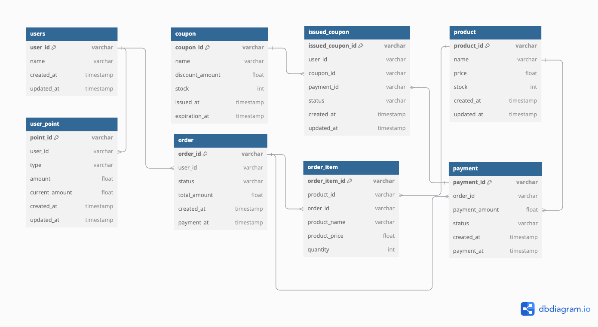

# E-Commerce ERD

---
- 과제 요구사항에 맞추어 점차적으로 고도화할 예정입니다.

1. `users (사용자)`
- 사용자 고유 식별자 (id)
- 사용자 이름 (name)
- 생성일시 (create_at)
- 업데이트일시 (updated_at)

2. `user_point (잔액)`
- 포인트 고유 식별자 (id)
- 사용자 고유 식별자 (user_id)
- 잔액 타입 (charge / use)
- 금액 (amount)
- 현재 잔액 (current_amount)
- 발생일시 (created_at)
- 업데이트일시 (updated_at)

3. `coupon (쿠폰)`
- 쿠폰 고유 식별자 (id)
- 사용자 고유 식별자 (user_id)
- 주문 고유 식별자 (order_id)
- 쿠폰명 (name)
- 할인 금액 (discount_amount)
- 수량 (stock)
- 쿠폰 상태 (status: available / used / expired)
- 발급일시 (issued_at)
- 만료일시 (expiration_at)

4. `order (주문)`
- 주문 고유 식별자 (id)
- 사용자 고유 식별자 (user_id)
- 주문 상태 (status: completed / waiting / cancelled)
- 전체 금액 (total_amount)
- 생성일시 (created_at)
- 결제일시 (payment_at)

5. `order_item (주문 상품)`
- 주문 상품 고유 식별자 (id)
- 상품 고유 식별자 (product_id)
- 주문 고유 식별자 (order_id)
- 상품명 (product_name)
- 상품 가격 (product_price)
- 수량 (quantity)

6. `payment (결제)`
- 결제 고유 식별자 (id)
- 주문 고유 식별자 (order_id)
- 결제 금액 (payment_amount)
- 결제 상태 (status: completed, failed)
- 생성일시 (created_at)
- 결제일시 (payment_at)
- 
7. `product (상품)`
- 상품 고유 식별자 (id)
- 상품명 (name)
- 가격 (price)
- 잔여 수량 (stock)
- 생성일시 (created_at)
- 업데이트일시 (update_at)
---
### 설명
- `Users`: 사용자의 기본 정보를 저장합니다. 잔액과 관련된 내역은 `BalanceHistory` 로 관리됩니다.
- `BalanceHistory`: 사용자의 잔액 히스토리를 관리합니다. 충전 및 사용 내역을 저장하며, 이를 통해 사용자의 잔액 흐름을 확인할 수 있습니다.
- `Coupon`: 사용자가 발급받은 쿠폰 정보입니다. 주문에 쿠폰이 적용될 수 있습니다.
- `Order`: 사용자가 주문한 내역을 저장합니다. 주문 상태와 결제 상태를 확인합니다.
- `OrderItem`: 하나의 주문 내에서 구매한 각 상품에 대한 정보를 저장합니다.
- `Payment`: 결제 정보를 저장합니다. 결제 완료 여부와 결제 금액을 확인합니다.
- `Product`: 상품의 정보와 잔여 수량을 관리합니다. 상품 결제 시 잔여수량을 차감합니다.

### 관계
- `Users`와 `BalanceHistory`는 1:N 관계입니다.
- `Users`와 `Coupon`, `Order`는 각각 1:N 관계입니다.
- `Order`와 `OrderItem`, `Payment`는 각각 1:N 관계입니다.
- `OrderItem`과 `Product`는 N:1 관계입니다.
- `Coupon`과 `Order`는 M:1 관계입니다.