## 동시성 문제에 대한 고찰

### 동시성 문제(Concurrency Issue)
여러 프로세스나 쓰레드가 동시에 같은 데이터에 접근하려 할 때 데이터의 일관성을 해칠 수 있는 상황을 말합니다. 

`동시성 문제`와 함께 아래의 내용을 이해해야 합니다.
`공유 자원`와 `공유 자원`는 프로그램의 안정성과 신뢰성에 직접적인 영향을 미치는 중요한 개념입니다. 

### 공유 자원 (Shared Resource)
`공유 자원`은 여러 프로세스나 쓰레드가 접근할 수 있는 자원을 말합니다. <Br>
한 번에 한 쓰레드 또는 프로세스만 접근하도록 해야한다는 제약이 필요하며, 동시 접근 시 데이터 무결성이 깨질 가능성이 있습니다.

### 경쟁 상태(Race Condition)
`경쟁 상태`는 `공유 자원`을 동시에 읽거나 쓰는 경우 발생할 수 있는 상황으로, 
`공유 자원`에 접근하는 순서와 타이밍에 따라 실행 결과가 달라지며, 데이터의 일관성이 보장되지 않는 문제가 발생합니다.
프로그램에서 동기화가 제대로 이루어지지 않을 때 발생하며, 데이터 손실, 충돌 및 예상치 못한 동작 등이 발생할 수 있습니다. 

`Example` 입출금 문제
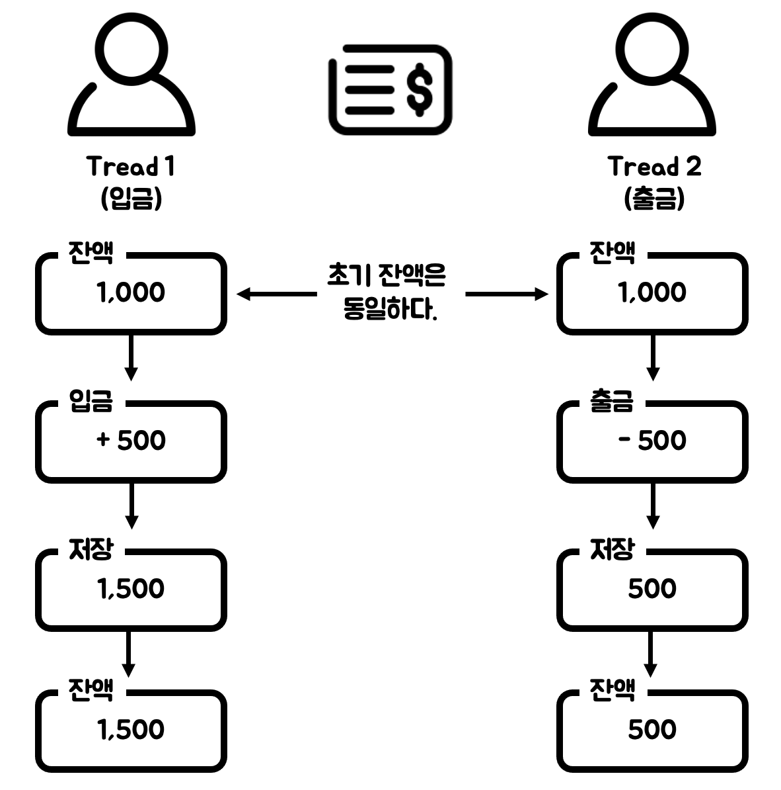
- `Thread 1`과 `Thread2`는 동시에 계좌 잔액 1,000원을 조회합니다.
- `Thread 1`은 500원을 입금하여 계좌 잔액을 1,500원으로 저장합니다.
- `Thread 2`는 500원을 출금하여 계좌 잔액을 500원으로 저장합니다.

계좌 잔액이 1,000원에서 `Thread-1`이 500원을 입금하고 
`Thread-2`가 500원을 출금한다면 계좌 잔액은 1,000원이어야 합니다. 
그러나 `공유 자원`인 계좌 잔액에 대해 `Thread-1`과 `Thread-2` 사이에서 `경쟁 상태`가 발생할 수 있으며 
최종 계좌 잔액은 1,000원이 아닐 가능성이 있습니다. 

이러한 문제가 발생할 수 있는 이유는 `원자성(Atomicity)`과 `가시성(Visibility)`이 보장되지 않았기 때문입니다.

`원자성`이란 하나의 작업이 중간에 끼어들거나 나누어지지 않고, 완전히 실행되거나 전혀 실행되지 않아야 한다는 것을 뜻합니다. <br>
다시 말해, 계좌 잔액을 조회하고 값을 변경한 뒤 변경된 값을 저장하는 것이 모두 하나의 단위 작업으로 실행 되어야 한다는 것입니다.

`가시성`이란 하나의 프로세스나 쓰레드가 수정한 값을 다른 프로세스나 스레드가 즉시 확인할 수 있어야 한다는 것을 의미합니다.<br>
위 예시와 같이, `Thread 1`이 변경한 계좌 잔액이 `Thread 2`에 반영되지 않아 데이터의 일관성이 깨질 수 있습니다.

### 임계 영역(Critical Section)
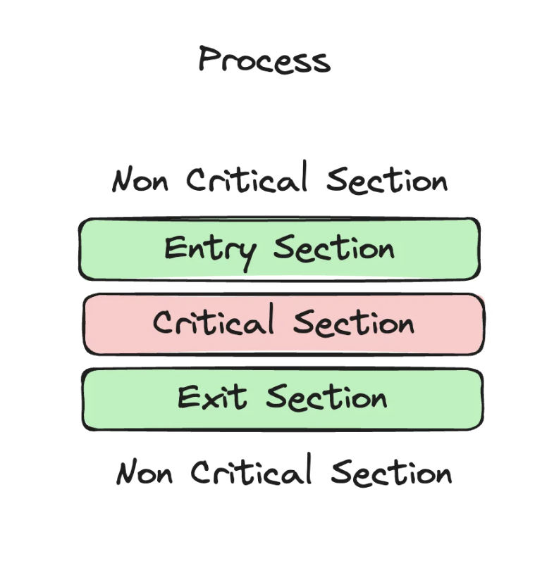
`임계 영역`이란 `공유 자원`에 접근하는 영역을 말하며 `경쟁 상태`가 발생하는 영역입니다.

`임계 영역`에서 `동기화 기법`을 통해 `경쟁 상태`를 해결할 수 있으며, 설계시 고려해야 할 조건이 있습니다.
아래 3가지는 멀티쓰레드 환경에서 자원에 대한 안전하고 효율적인 접근을 보장하기 위한 핵심원칙입니다.

1. `상호 배제(Mutual Exclusion)`: 임계영역의 핵심이며, 임계 영역에 동시에 하나의 프로세스나 쓰레드만 접근할 수 있도록 보장하는 특성을 말합니다.
2. `진행(Progress)`: 임계 영역에 진입하려는 쓰레드가 하나라도 있을 경우, 다른 스레드가 해당 진입을 방해하지 않도록 보장하는 특성을 말합니다.
3. `한정 대기(Bounded Waiting)`: 한 쓰레드가 임계영역에 접근하기 위해 대기하는 시간이 지나치게 길어지지 않도록 보장하는 특성을 말합니다.

이번 STEP11, STEP 12 과제에서는 데이터베이스에서 발생할 수 있는 동시성 문제를 파악하고 해결해보고자 합니다.

## 이커머스 프로젝트에서의 동시성 문제 해결 방안
데이터베이스의 동시성 문제를 해결하기 위한 동시성 제어 기법에는 
`Database Lock`과 `Redis`를 활용한`Distributed Lock`이 있습니다. 
테스트를 통해 동시성 제어 기법을 비교하여 이번 과제에서 발생할 수 있는 동시성 문제를 해결하고자 합니다.

```
[시나리오]
최초 재고가 1,000개인 특정 상품(Laptop)에 대해 아래와 같이 요청을 보낸다.

10명의 사용자가 동시에 재고 1개 차감 요청
50명의 사용자가 동시에 재고 1개 차감 요청
100명의 사용자가 동시에 재고 1개 차감 요청
```

재고 차감에 대한 로직은 아래와 같이 구현하였습니다.
```aidl
@Transactional
public Product reduceProduct(long productId, long quantity) {
        Product product = productRepository.findById(productId)
                .orElseThrow(() -> new IllegalStateException(ExceptionMessage.PRODUCT_NOT_FOUND.getMessage()));

        product.reduceStock(quantity);

        productRepository.save(product);

        return product;
    }
```

### 1. 트랜잭션 격리 수준 확인
현재 데이터베이스에 설정된 트랜잭션 격리 수준을 확인하기 위해 MySQL CLI에서  `SELECT @@SESSION.transaction_isolation`을 실행하였습니다.
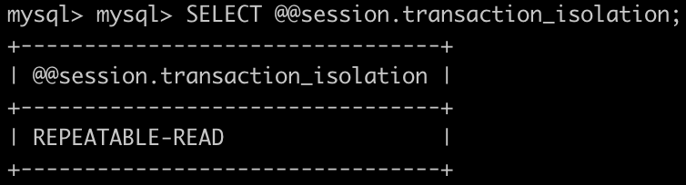
InnoDB의 기본값인 REPEATABLE_READ로 설정되어 있는 것을 확인하였습니다.
REPEATABLE_READ 상태에서 테스트를 진행하였으며, 테스트 결과는 아래와 같습니다. 

`상품 재고 테스트결과`

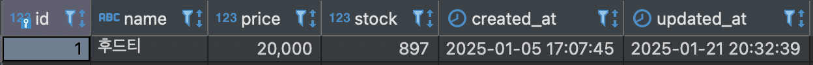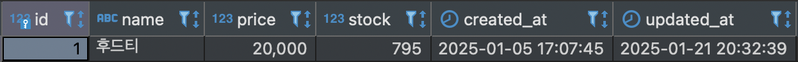

`Jmeter 결과`

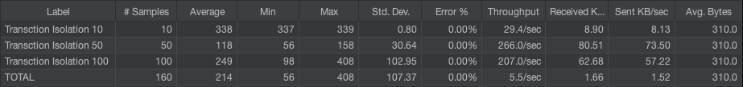
최종 재고는 `860`이어야 하는데 `795`인 것을 확인할 수 있었습니다.
일부 재고 차감 요청이 누락되거나 잘못된 재고 수량으로 업데이트된 것이라고 생각합니다.
`REPEATABLE_READ`는 같은 트랜잭션 내에서 데이터의 일관성을 어느 정도 보장하지만, 
다수의 요청이 동시에 발생할 때 데이터 일관성을 보장하지 못하는 것으로 보입니다.

### 2. 낙관적 락(Optimistic Lock) 적용하기
`@Version`필드를 통해 버전 관리를 설정하고, `@Lock(LockModeType.OPTIMISTIC)`으로 `낙관적 락`을 적용하였습니다. 

`상품 재고 테스트결과`

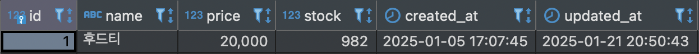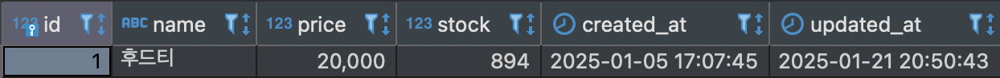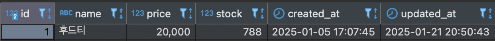

`Jmeter 결과`

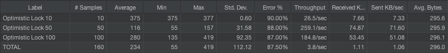

충돌로 인해 트랜잭션에서 ObjectOptimisticLockingFailureException이 발생한 것을 확인할 수 있습니다. 
해당 요청은 자동으로 롤백되었으며, 증가한 버전 만큼 상품 재고가 차감된 것을 확인 할 수 있습니다.

### 3. 비관적 락(Pessimistic Lock) 적용하기
`@Lock(LockModeType.PESSIMISTIC_WRITE)`으로 비관적 락을 적용하여 다른 트랜잭션이 해당 자원을 수정하지 못하도록 합니다.
```aidl
@Lock(LockModeType.PESSIMISTIC_WRITE)
Optional<Product> findById(long id);
```
`상품 재고 테스트결과`

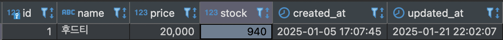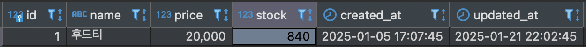

`Jmeter 결과`

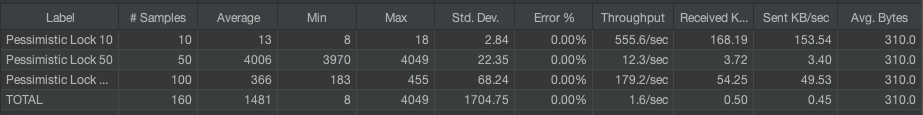
상품 재고 차감이 정확하게 이루어진 것을 확인할 수 있다. 
그러나 `비관적 락`으로 인해 다수의 요청이 대기 상태로 전환되면서 처리 시간이 증가하였습니다. 

### 4. 분산 락(Distributed Lock) 적용
`Redis`는 `RedLock`알고리즘을 통해 `Lock`을 제공합니다. <br>
`Redisson`라는 라이브러리를 활용하여 분산락을 구현하기 위해 
`implementation("org.redisson:redisson-spring-boot-starter:3.37.0")` 의존성을 추가하였습니다.

Redis 서버가 `localhost:6379` 에 떠있다는 가정으로 `RedissonClient`를 Bean으로 등록합니다.
```aidl
@Configuration
public class RedissonConfig {

    private static final String REDISSON_HOST_PREFIX = "redis://";

    @Bean
    public RedissonClient redissonClient() {
        Config config = new Config();
        config.useSingleServer().setAddress(REDISSON_HOST_PREFIX + "localhost:6379");
        return Redisson.create(config);
    }
}
```


분산락 AOP를 설정합니다. 분산락의 사용여부 또는 부가설정을할 수 있는 어노테이션을 생성합니다.
```aidl
@Target(ElementType.METHOD)
@Retention(RetentionPolicy.RUNTIME)
public @interface RedissonLock {

    String key();

    TimeUnit timeUnit() default TimeUnit.MILLISECONDS;

    long waitTime() default 5000L;

    long leaseTime() default 2000L;
}
```

`@RedissonLock` 어노테이션을 사용하면 메서드 실행 시 Redisson의 락을 자동으로 획득하고, 
메서드 실행이 끝난 후 락을 해제하는 기능을 제공하므로 분산 시스템에서 자원의 경합을 방지할 수 있습니다.
```aidl
@RedissonLock(key = "'product'.concat(':').concat(#productId)")
```

`상품 재고 테스트결과`

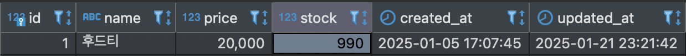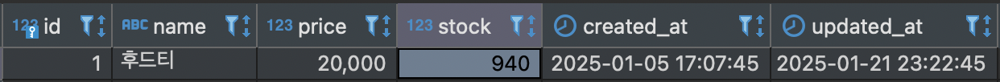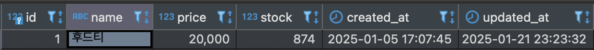

`Jmeter 결과`

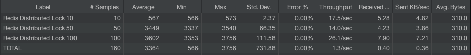
락을 획득하지 못한 요청에서 예외가 발생하였으며, 해당 예외를 제외한 요청에 대한 상품 재고 차감은 잘 반영된 것을 확인할 수 있습니다.

### 결론

1. 포인트 충전 및 사용
   - 낙관적 락을 사용합니다.
   - 충돌 발생 시 재시도를 통해 일관성을 유지하며, 락 유지 비용을 최소화하여 성능을 보장합니다.
2. 상품 재고 감소
    - Redis 분산 락을 사용합니다.
    - 분산 환경에서 재고의 일관성을 보장할 수 있도록 분산락을 사용하고 동일한 데이터에 대해 동기화를 보장하며 안전하게 재고를 관리할 수 있습니다. 
3. 쿠폰 발급 
   - Redis 분삭 락을 사용합니다. 
   - 분산 환경에서 하나의 서버만 락을 획득하면서 쿠폰을 발급할 수 있게 되어 경합을 방지할 수 있습니다. 
   - Redis 분산 락을 사용하면 동일한 사용자가 두 번 발급받는 상황을 방지할 수 있습니다.