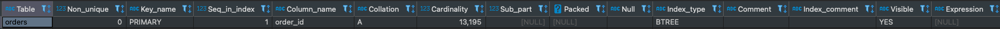
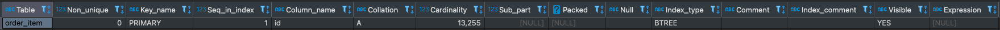
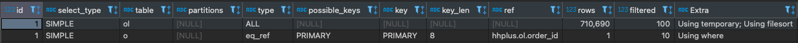
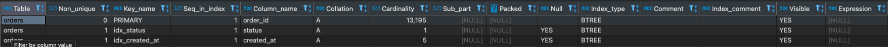
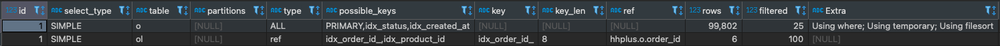
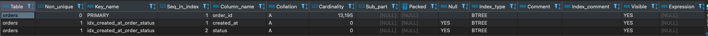
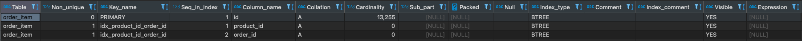
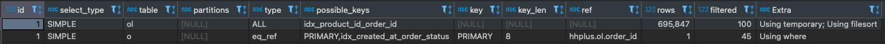

# 인덱스(Index)를 활용한 데이터베이스 성능 최적화

---

## 목차
* [인덱스 알아보기](#인덱스-알아보기)
  + [인덱스란?](#인덱스란)
  + [인덱스의 장/단점](#인덱스의-장점과-단점)
  + [인덱스 사용이 적합한 경우](#인덱스-사용이-적합한-경우)
  + [단일 컬럼 인덱스와 복합 컬럼 인덱스](#단일-컬럼-인덱스와-복합-컬럼-인덱스)
  + [인덱스 자료구조](#인덱스-자료구조)
+ [주요 조회 쿼리](#주요-조회-쿼리)
  + [상위 주문 상품 집계](#상위-주문-상품-집계)
  + [쿼리 성능 개선을 위한 인덱스 적용 및 분석](#쿼리-성능-개선을-위한-인덱스-적용-및-분석)
  + [복합 인덱스 생성을 통한 결과 확인](#복합-인덱스-생성을-통한-결과-확인)
  + [결과 비교 및 분석](#결과-비교-및-분석)
  
---
## 인덱스 알아보기

### 인덱스란?
- `인덱스(Index)`는 **데이터베이스 테이블의 조회 속도를 향상시키기 위한 자료 구조**입니다.
- 데이터베이스 내의 특정 컬럼(열)이나 컬럼들의 조합에 대한 값과 해당 값이 저장된 레코드(행)의 위치를 매핑하여 데이터베이스 쿼리의 성능을 최적화하는 데 중요한 역할을 합니다.
- 데이터를 검색할 때 전체 테이블을 스캔하는 것이 아니라, 인덱스를 사용하여 검색 대상 레코드의 범위를 줄일 수 있습니다. 이것은 대량의 데이터를 다루는 경우 데이터 검색 속도를 크게 향상시킵니다.

### 인덱스의 장점과 단점 
- 장점 
  - 검색 속도와 그에 따른 성능을 향상시킬 수 있습니다.
  - 테이블 Full-Scan 을 방지할 수 있습니다.
- 단점 
  - 생성/수정/삭제가 빈번한 테이블에 인덱스를 걸면 인덱스 크기가 비대해져 오히려 성능이 저하될 수 있습니다.
  - 인덱스를 재정렬하는 작업이 필요합니다.
  - 인덱스를 위한 추가적인 저장공간이 필요합니다. (DB의 약 10%)

### 인덱스 사용이 적합한 경우
- 규모가 작지 않은 테이블
- INSERT / UPDATE / DELETE 가 자주 발생하지 않는 컬럼
- JOIN / WHERE / ORDER BY 에 자주 사용되는 컬럼
- 데이터의 중복도가 낮은 컬럼 (카디널리티가 높은 컬럼)

### 단일 컬럼 인덱스와 복합 컬럼 인덱스
- **단일 컬럼 인덱스**
  - 하나의 컬럼에 대한 인덱스
  - 단일 컬럼 인덱스는 해당 컬럼에 대한 검색을 빠르게 할 수 있지만, 여러 컬럼을 조합한 검색에는 적합하지 않습니다.
  - 해당 컬럼의 카디널리티가 높은 것을 선택해야 합니다.
- **복합 컬럼 인덱스**
  - 두 개 이상의 컬럼에 대한 인덱스
  - 복합 컬럼 인덱스는 여러 컬럼을 조합한 검색에 적합합니다.
  - 카디널리티가 높은 순서에서 낮은 순서로 인덱스를 생성하는 것이 좋습니다.
    - **카디널리티가 낮다고 해서 무조건 뒤에 배치하는 것이 아니라** 아니라 첫 번째 컬럼에서 데이터를 많이 걸러낼 수 있다면 먼저 배치하는 것이 좋습니다.
  - 반드시 첫 번째 컬럼은 조회 조건에 포함되어야 인덱스를 탈 수 있습니다.
  
### 인덱스 자료구조
- **Hash Table**
  - 키-값(Key-Value) 쌍을 저장하는 자료구조
  - 빠른 검색 속도를 제공합니다.
  - 데이터가 정렬될 필요가 없습니다.
- **B-Tree**
  - 가장 일반적으로 사용되는 인덱스 구조
  - 모든 노드가 정렬된 상태를 유지하며, 하나의 노드에 여러 개의 키 값을 가질 수 있습니다.
  - 탐색 속도가 일정하며 데이터가 정렬된 상태로 유지됩니다. 
- **B+Tree**
  - B-Tree 인덱스의 변형으로, B-Tree 인덱스의 단점을 보완한 구조
  - B-Tree보다 범위 검색이 빠릅니다. 
  - 트리의 높이가 낮아 탐색 성능이 향상됩니다.

### 실행 계획(EXPLAIN)
- 데이터베이스가 특정 SQL 쿼리를 실행할 때 어떤 방식으로 데이터를 검색하고 처리하는지를 보여주는 기능입니다.
  ```sql
  EXPLAIN SELECT orders WHERE create_at = '2025-02-11' 
  ```
| 컬럼명          | 설명                             |
|---------------|--------------------------------|
| `id`          | 실행 순서를 나타냅니다.                  | 
| `select_type` | 쿼리 유형을 나타냅니다.                  | 
| `table`       | 조회하는 테이블을 나타냅니다.               | 
| `type`        | 테이블 접근 방식을 나타냅니다.              |
| `possible_keys` | 사용할 수 있는 인덱스를 나타냅니다.          |
| `key`         | 실제 사용된 인덱스를 나타냅니다.             |
| `rows`        | 예상 조회 행 수를 나타냅니다.              |
| `Extra`       | 추가적인 실행 정보를 제공합니다.             |


아래는 e-commerce 시나리오의 **주요 조회 쿼리를 분석하고 인덱스를 활용하여 데이터베이스 성능을 최적화**하고자 합니다.

### 주요 조회 쿼리
`PK(Primary Key)`로 조회하는 쿼리는 이미 `인덱스(Index)`가 적용되어 있다고 판단하여 제외하였습니다.

### 상위 주문 상품 집계

`주문 테이블`
```sql
CREATE TABLE `hhplus`.`orders` (
    `order_id` bigint NOT NULL AUTO_INCREMENT,
    `user_id` bigint DEFAULT NULL,
    `status` varchar(50) DEFAULT NULL,
    `created_at` timestamp NULL DEFAULT CURRENT_TIMESTAMP,
    `updated_at` timestamp NULL DEFAULT CURRENT_TIMESTAMP ON UPDATE CURRENT_TIMESTAMP,
    PRIMARY KEY (`order_id`)
);
```

`주문 상품 테이블`
```sql
CREATE TABLE `hhplus`.`order_item` (
    `id`    BIGINT  NOT NULL    AUTO_INCREMENT,
    `order_id`   BIGINT  NOT NULL,
    `product_id`   BIGINT  NOT NULL,
    `product_name`   VARCHAR(100)  NOT NULL,
    `product_price`    BIGINT  NOT NULL,
    `quantity`  BIGINT NOT NULL,
    `created_at` timestamp NULL DEFAULT CURRENT_TIMESTAMP,
    `updated_at` timestamp NULL DEFAULT CURRENT_TIMESTAMP ON UPDATE CURRENT_TIMESTAMP,
    PRIMARY KEY (`id`)
);
```

### 쿼리 성능 개선을 위한 인덱스 적용 및 분석

`상위 주문 상품 집계 쿼리`: 주문이 많은 상위 5개 상품 ID를 조회합니다.
```sql
SELECT ol.product_id
FROM order_item ol
INNER JOIN orders o ON o.order_id = ol.order_id 
WHERE o.status != 'CANCELED'
AND o.created_at BETWEEN ? and ?
GROUP BY ol.product_id
ORDER BY sum(ol.quantity) DESC
LIMIT 5;
```


위 조회 쿼리에 대해 주문 데이터 100,000건과 해당 주문 데이터에 대한 주문 상품 데이터 약 700,000건을 생성한 후 `인덱스(Index)` 생성 전과 후를 비교하였습니다.

**[BEFORE]**
```sql
SHOW INDEX FROM orders;
```


```sql
SHOW INDEX FROM order_item;
```


- EXPLAIN

  ```sql
    [실행 계획]
    1. order_item
      - type: ALL
      - key: -
      - rows: 710690
      - filtered: 100
      - extra: using temporary; using filesort;
    2. orders
      - type: eq_ref
      - key: PRIMARY
      - rows: 1
      - filtered: 10
      - extra: using where;
    ```

- EXPLAIN ANALYZE
  ```sql
  -> Limit: 5 row(s)  (actual time=3932..3932 rows=0 loops=1)
  -> Sort: `sum(ol.quantity)` DESC, limit input to 5 row(s) per chunk  (actual time=3932..3932 rows=0 loops=1)
  -> Table scan on <temporary>  (actual time=3932..3932 rows=0 loops=1)
  -> Aggregate using temporary table  (actual time=3932..3932 rows=0 loops=1)
  -> Nested loop inner join  (cost=320748 rows=71062) (actual time=3932..3932 rows=0 loops=1)
  -> Table scan on ol  (cost=72006 rows=710690) (actual time=1.61..408 rows=713654 loops=1)
  -> Filter: ((o.`status` <> 'CANCELED') and (o.created_at between '2025-02-07' and '2025-02-10'))  (cost=0.25 rows=0.1) (actual time=0.00475..0.00475 rows=0 loops=713654)
  -> Single-row index lookup on o using PRIMARY (order_id = ol.order_id)  (cost=0.25 rows=1) (actual time=0.00337..0.00342 rows=0.998 loops=713654)
  ```

- EXECUTE
  ```sql
  SELECT ol.product_id
  FROM order_item ol
  INNER JOIN orders o ON o.order_id = ol.order_id
  WHERE o.status != 'CANCELED'
  AND o.created_at BETWEEN '2025-02-07' and '2025-02-10'
  GROUP BY ol.product_id
  ORDER BY sum(ol.quantity) DESC
  LIMIT 5;
  5 rows retrieved starting from 1 in 1 s 276 ms (execution: 1 s 262 ms, fetching: 14 ms)
  ```
  
**[AFTER]**

해당 쿼리는 `orders` 테이블의 `status`컬럼과 `created_at`컬럼을 조건으로 필터링하고, `order_item` 테이블의 `product_id` 컬럼을 그룹화하여 수량을 기준으로 내림차순 정렬합니다.

먼저, 필터링을 기준으로 개별 `인덱스(Index)` 생성 후 결과를 확인해보겠습니다.

- INDEX

  `orders`
  ```sql
  CREATE INDEX idx_status ON `hhplus`.`orders` (`status`);
  CREATE INDEX idx_created_at ON `hhplus`.`orders` (`created_at`);
  ```
  

  `order_item`
  ```sql
  CREATE INDEX idx_order_id_ ON `hhplus`.`order_item` (`order_id`);
  CREATE INDEX idx_product_id ON `hhplus`.`order_item` (`product_id`);
  ```
  


- EXPLAIN
  
  ```sql
    [실행 계획]
    1. orders
    - type: ALL
    - key: -
    - rows: 99802
    - filtered: 25
    - extra: using where; using temporary; using filesort;
    2. order_line
    - type: ref
    - key: idx_order_id
    - rows: 6
    - filtered: 100
    - extra: -
    ```

- EXPLAIN ANALYZE
  ```sql
  -> Limit: 200 row(s)  (actual time=386..386 rows=0 loops=1)
  -> Sort: `sum(ol.quantity)` DESC, limit input to 200 row(s) per chunk  (actual time=386..386 rows=0 loops=1)
  -> Table scan on <temporary>  (actual time=386..386 rows=0 loops=1)
  -> Aggregate using temporary table  (actual time=386..386 rows=0 loops=1)
  -> Nested loop inner join  (cost=66975 rows=162524) (actual time=386..386 rows=0 loops=1)
  -> Filter: ((o.`status` <> 'CANCELED') and (o.created_at between '2025-02-08 00:00:00' and '2025-02-10 23:59:59'))  (cost=10091 rows=24951) (actual time=0.197..141 rows=100000 loops=1)
  -> Table scan on o  (cost=10091 rows=99802) (actual time=0.19..47.4 rows=100000 loops=1)
  -> Index lookup on ol using idx_order_id_ (order_id = o.order_id)  (cost=1.63 rows=6.51) (actual time=0.00225..0.00225 rows=0 loops=100000)
  ```

- EXECUTE
  ```sql
  SELECT ol.product_id
  FROM order_item ol
  INNER JOIN orders o ON o.order_id = ol.order_id 
  WHERE o.status != 'CANCELED'
  AND o.created_at BETWEEN '2025-02-08 00:00:00' and '2025-02-10 23:59:59'
  GROUP BY ol.product_id
  ORDER BY sum(ol.quantity) DESC
  LIMIT 5;
  5 rows retrieved starting from 1 in 1 s 276 ms (execution: 1 s 262 ms, fetching: 14 ms)
  ```

### 복합 인덱스 생성을 통한 결과 확인  

- INDEX

  `orders`
  ```sql
  CREATE INDEX idx_created_at_order_status ON `hhplus`.`orders` (`created_at`, `status`);
  ```
  
  `order_item`
  ```sql
  CREATE INDEX idx_product_id_order_id ON `hhplus`.`order_item` (`product_id`, `order_id`);
  ```
  


- EXPLAIN
  
  ```sql
  [실행 계획]
  1. order_item
  - type: ALL
  - key: -
  - rows: 695847
  - filtered: 100
  - extra: using temporary; using filesort;
  2. orders
  - type: eq_ref
  - key: PRIMARY
  - rows: 1
  - filtered: 45
  - extra: using where;
  ```
  
- EXPLAIN ANALYZE
  ```sql
  -> Limit: 5 row(s)  (actual time=156..156 rows=0 loops=1)
  -> Sort: `sum(ol.quantity)` DESC, limit input to 5 row(s) per chunk  (actual time=156..156 rows=0 loops=1)
  -> Table scan on <temporary>  (actual time=156..156 rows=0 loops=1)
  -> Aggregate using temporary table  (actual time=156..156 rows=0 loops=1)
  -> Nested loop inner join  (cost=314053 rows=313131) (actual time=156..156 rows=0 loops=1)
  -> Table scan on ol  (cost=70506 rows=695847) (actual time=156..156 rows=0 loops=1)
  -> Filter: ((o.`status` <> 'CANCELED') and (o.created_at between '2025-02-08 00:00:00' and '2025-02-10 23:59:59'))  (cost=0.25 rows=0.45) (never executed)
  -> Single-row index lookup on o using PRIMARY (order_id = ol.order_id)  (cost=0.25 rows=1) (never executed)
  ```

- EXECUTE
  ```sql
  SELECT ol.product_id
  FROM order_item ol
  INNER JOIN orders o ON o.order_id = ol.order_id
  WHERE o.status != 'CANCELED'
  AND o.created_at BETWEEN '2025-02-08 00:00:00' and '2025-02-10 23:59:59'
  GROUP BY ol.product_id
  ORDER BY sum(ol.quantity) DESC
  LIMIT 5;
  5 rows retrieved starting from 1 in 1 s 460 ms (execution: 1 s 445 ms, fetching: 15 ms)
  ```

### 결과 비교 및 분석
1. **단일 컬럼 인덱스 생성 후 성능 변화**
  - `order_item`의 인덱스 `idx_order_id`, `idx_product_id`와 `orders`의 인덱스 `idx_order_status`, `idx_created_at`를 생성한 후, 실행 시간이 2초대로 오히려 증가하였습니다.
  - `orders`에서 `status`와 `created_at` 조건이 분리된 단일 컬럼 인덱스 방식은 각 조건별 필터링에는 효과적일 수 있다고 생각하지만 기대한 결과가 나오지 않았습니다.
2. **복합 인덱스 생성 후 성능 변화**
  - `orders`에 `(created_at, status)`, `order_item`에 `(product_id, order_id)` 복합 인덱스를 생성한 후, 실행 계획과 실행 시간이 이전보다 더 개선된 것을 확인할 수 있었습니다.
  - `EXPLAIN ANALYZE`결과에서 `order_item`에 대한 테이블 스캔이 여전히 존재하지만, 복합 인덱스를 사용하여 조건 필터링과 정렬을 모두 인덱스에서 처리하면서 성능이 다소 향상된 것으로 생각됩니다.
3. **결론**
  - 복합 인덱스를 추가한 후 쿼리 성능이 개선되었으나, 최적화는 여전히 필요하다는 것입니다.
  - `order_item`에 대한 테이블 스캔을 줄이기 위해 더 나은 인덱스 전략을 찾고, 쿼리 구조를 변경해야 합니다.