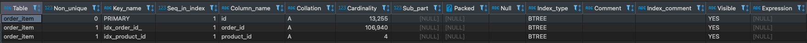

# 인덱스(Index)를 활용한 데이터베이스 성능 최적화
`인덱스(Index)`는 **데이터베이스 테이블의 조회 속도를 향상시키기 위한 자료 구조**입니다.

e-commerce 시나리오의 **주요 조회 쿼리를 분석하고 인덱스를 활용하여 데이터베이스 성능을 최적화**하고자 합니다.

## 주요 조회 쿼리
`PK(Primary Key)`로 조회하는 쿼리는 이미 `인덱스(Index)`가 적용되어 있다고 판단하여 제외하였습니다.

### 상위 주문 상품 집계

`주문 테이블`
```sql
CREATE TABLE `hhplus`.`orders` (
    `order_id` bigint NOT NULL AUTO_INCREMENT,
    `user_id` bigint DEFAULT NULL,
    `status` varchar(50) DEFAULT NULL,
    `created_at` timestamp NULL DEFAULT CURRENT_TIMESTAMP,
    `updated_at` timestamp NULL DEFAULT CURRENT_TIMESTAMP ON UPDATE CURRENT_TIMESTAMP,
    PRIMARY KEY (`order_id`)
);
```

`주문 상품 테이블`
```sql
CREATE TABLE `hhplus`.`order_item` (
    `id`    BIGINT  NOT NULL    AUTO_INCREMENT,
    `order_id`   BIGINT  NOT NULL,
    `product_id`   BIGINT  NOT NULL,
    `product_name`   VARCHAR(100)  NOT NULL,
    `product_price`    BIGINT  NOT NULL,
    `quantity`  BIGINT NOT NULL,
    `created_at` timestamp NULL DEFAULT CURRENT_TIMESTAMP,
    `updated_at` timestamp NULL DEFAULT CURRENT_TIMESTAMP ON UPDATE CURRENT_TIMESTAMP,
    PRIMARY KEY (`id`)
);
```

`상위 주문 상품 집계 쿼리`: 주문이 많은 상위 5개 상품 ID를 조회한다.
```sql
SELECT ol.product_id
FROM order_item ol
INNER JOIN orders o ON o.order_id = ol.order_id 
WHERE o.status != 'CANCELED'
AND o.created_at BETWEEN ? and ?
GROUP BY ol.product_id
ORDER BY sum(ol.quantity) DESC
LIMIT 5;
```


위 조회 쿼리에 대해 주문 데이터 100,000건과 해당 주문 데이터에 대한 주문 상품 데이터 약 700,000건을 생성한 후 `인덱스(Index)` 생성 전과 후를 비교하였습니다.

**[BEFORE]**
```sql
SHOW INDEX FROM orders;
```


```sql
SHOW INDEX FROM order_item;
```


- EXPLAIN

  ```
    [실행 계획]
    1. order_item
      - type: ALL
      - key: -
      - rows: 710690
      - filtered: 100
      - extra: using temporary; using filesort;
    2. orders
      - type: eq_ref
      - key: PRIMARY
      - rows: 1
      - filtered: 10
      - extra: using where;
    ```

- EXPLAIN ANALYZE
  ```
  -> Limit: 5 row(s)  (actual time=3932..3932 rows=0 loops=1)
  -> Sort: `sum(ol.quantity)` DESC, limit input to 5 row(s) per chunk  (actual time=3932..3932 rows=0 loops=1)
  -> Table scan on <temporary>  (actual time=3932..3932 rows=0 loops=1)
  -> Aggregate using temporary table  (actual time=3932..3932 rows=0 loops=1)
  -> Nested loop inner join  (cost=320748 rows=71062) (actual time=3932..3932 rows=0 loops=1)
  -> Table scan on ol  (cost=72006 rows=710690) (actual time=1.61..408 rows=713654 loops=1)
  -> Filter: ((o.`status` <> 'CANCELED') and (o.created_at between '2025-02-07' and '2025-02-10'))  (cost=0.25 rows=0.1) (actual time=0.00475..0.00475 rows=0 loops=713654)
  -> Single-row index lookup on o using PRIMARY (order_id = ol.order_id)  (cost=0.25 rows=1) (actual time=0.00337..0.00342 rows=0.998 loops=713654)
  ```

- EXECUTE
  ```
  SELECT ol.product_id
  FROM order_item ol
  INNER JOIN orders o ON o.order_id = ol.order_id
  WHERE o.status != 'CANCELED'
  AND o.created_at BETWEEN '2025-02-07' and '2025-02-10'
  GROUP BY ol.product_id
  ORDER BY sum(ol.quantity) DESC
  LIMIT 5;
  5 rows retrieved starting from 1 in 1 s 276 ms (execution: 1 s 262 ms, fetching: 14 ms)
  ```
  
**[AFTER]**

해당 쿼리는 `orders` 테이블의 `status`컬럼과 `created_at`컬럼을 조건으로 필터링하고, `order_item` 테이블의 `product_id` 컬럼을 그룹화하여 수량을 기준으로 내림차순 정렬합니다.

먼저, 필터링을 기준으로 개별 `인덱스(Index)` 생성 후 결과를 확인해보겠습니다.

- INDEX

  `orders`
  ```sql
  CREATE INDEX idx_status ON `hhplus`.`orders` (`status`);
  CREATE INDEX idx_created_at ON `hhplus`.`orders` (`created_at`);
  ```
  

  `order_item`
  ```sql
  CREATE INDEX idx_order_id_ ON `hhplus`.`order_item` (`order_id`);
  CREATE INDEX idx_product_id ON `hhplus`.`order_item` (`product_id`);
  ```
  


- EXPLAIN
  
  ```
    [실행 계획]
    1. orders
    - type: ALL
    - key: -
    - rows: 99802
    - filtered: 25
    - extra: using where; using temporary; using filesort;
    2. order_line
    - type: ref
    - key: idx_order_id
    - rows: 6
    - filtered: 100
    - extra: -
    ```

- EXPLAIN ANALYZE
  ```
  -> Limit: 200 row(s)  (actual time=386..386 rows=0 loops=1)
  -> Sort: `sum(ol.quantity)` DESC, limit input to 200 row(s) per chunk  (actual time=386..386 rows=0 loops=1)
  -> Table scan on <temporary>  (actual time=386..386 rows=0 loops=1)
  -> Aggregate using temporary table  (actual time=386..386 rows=0 loops=1)
  -> Nested loop inner join  (cost=66975 rows=162524) (actual time=386..386 rows=0 loops=1)
  -> Filter: ((o.`status` <> 'CANCELED') and (o.created_at between '2025-02-08 00:00:00' and '2025-02-10 23:59:59'))  (cost=10091 rows=24951) (actual time=0.197..141 rows=100000 loops=1)
  -> Table scan on o  (cost=10091 rows=99802) (actual time=0.19..47.4 rows=100000 loops=1)
  -> Index lookup on ol using idx_order_id_ (order_id = o.order_id)  (cost=1.63 rows=6.51) (actual time=0.00225..0.00225 rows=0 loops=100000)
  ```

- EXECUTE
  ```
  SELECT ol.product_id
  FROM order_item ol
  INNER JOIN orders o ON o.order_id = ol.order_id 
  WHERE o.status != 'CANCELED'
  AND o.created_at BETWEEN '2025-02-08 00:00:00' and '2025-02-10 23:59:59'
  GROUP BY ol.product_id
  ORDER BY sum(ol.quantity) DESC
  LIMIT 5;
  5 rows retrieved starting from 1 in 1 s 276 ms (execution: 1 s 262 ms, fetching: 14 ms)
  ```

### `복합 인덱스` 생성을 통한 결과 확인  

- INDEX

  `orders`
  ```
  CREATE INDEX idx_created_at_order_status ON `hhplus`.`orders` (`created_at`, `status`);
  ```
  
  `order_item`
  ```
  CREATE INDEX idx_product_id_order_id ON `hhplus`.`order_item` (`product_id`, `order_id`);
  ```
  


- EXPLAIN
  
  ```
  [실행 계획]
  1. order_item
  - type: ALL
  - key: -
  - rows: 695847
  - filtered: 100
  - extra: using temporary; using filesort;
  2. orders
  - type: eq_ref
  - key: PRIMARY
  - rows: 1
  - filtered: 45
  - extra: using where;
  ```
  
- EXPLAIN ANALYZE
  ```
  -> Limit: 5 row(s)  (actual time=156..156 rows=0 loops=1)
  -> Sort: `sum(ol.quantity)` DESC, limit input to 5 row(s) per chunk  (actual time=156..156 rows=0 loops=1)
  -> Table scan on <temporary>  (actual time=156..156 rows=0 loops=1)
  -> Aggregate using temporary table  (actual time=156..156 rows=0 loops=1)
  -> Nested loop inner join  (cost=314053 rows=313131) (actual time=156..156 rows=0 loops=1)
  -> Table scan on ol  (cost=70506 rows=695847) (actual time=156..156 rows=0 loops=1)
  -> Filter: ((o.`status` <> 'CANCELED') and (o.created_at between '2025-02-08 00:00:00' and '2025-02-10 23:59:59'))  (cost=0.25 rows=0.45) (never executed)
  -> Single-row index lookup on o using PRIMARY (order_id = ol.order_id)  (cost=0.25 rows=1) (never executed)
  ```

- EXECUTE
  ```
  SELECT ol.product_id
  FROM order_item ol
  INNER JOIN orders o ON o.order_id = ol.order_id
  WHERE o.status != 'CANCELED'
  AND o.created_at BETWEEN '2025-02-08 00:00:00' and '2025-02-10 23:59:59'
  GROUP BY ol.product_id
  ORDER BY sum(ol.quantity) DESC
  LIMIT 5;
  5 rows retrieved starting from 1 in 1 s 460 ms (execution: 1 s 445 ms, fetching: 15 ms)
  ```

### [결과 비교 및 분석]
1. 단일 컬럼 인덱스 생성 후 성능 변화
  - `order_item`의 인덱스 `idx_order_id`, `idx_product_id`와 `orders`의 인덱스 `idx_order_status`, `idx_created_at`를 생성한 후, 실행 시간이 2초대로 오히려 증가하였습니다.
  - `orders`에서 `status`와 `created_at` 조건이 분리된 단일 컬럼 인덱스 방식은 각 조건별 필터링에는 효과적일 수 있다고 생각하지만 기대한 결과가 나오지 않았습니다.
2. 복합 인덱스 생성 후 성능 변화
  - `orders`에 `(created_at, status)`, `order_item`에 `(product_id, order_id)` 복합 인덱스를 생성한 후, 실행 계획과 실행 시간이 이전보다 더 개선된 것을 확인할 수 있었습니다.
  - `EXPLAIN ANALYZE`결과에서 `order_item`에 대한 테이블 스캔이 여전히 존재하지만, 복합 인덱스를 사용하여 조건 필터링과 정렬을 모두 인덱스에서 처리하면서 성능이 다소 향상된 것으로 생각됩니다.
3. 결론
  - 복합 인덱스를 추가한 후 쿼리 성능이 개선되었으나, 최적화는 여전히 필요하다는 것입니다.
  - `order_item`에 대한 테이블 스캔을 줄이기 위해 더 나은 인덱스 전략을 찾고, 쿼리 구조를 변경해야 합니다.