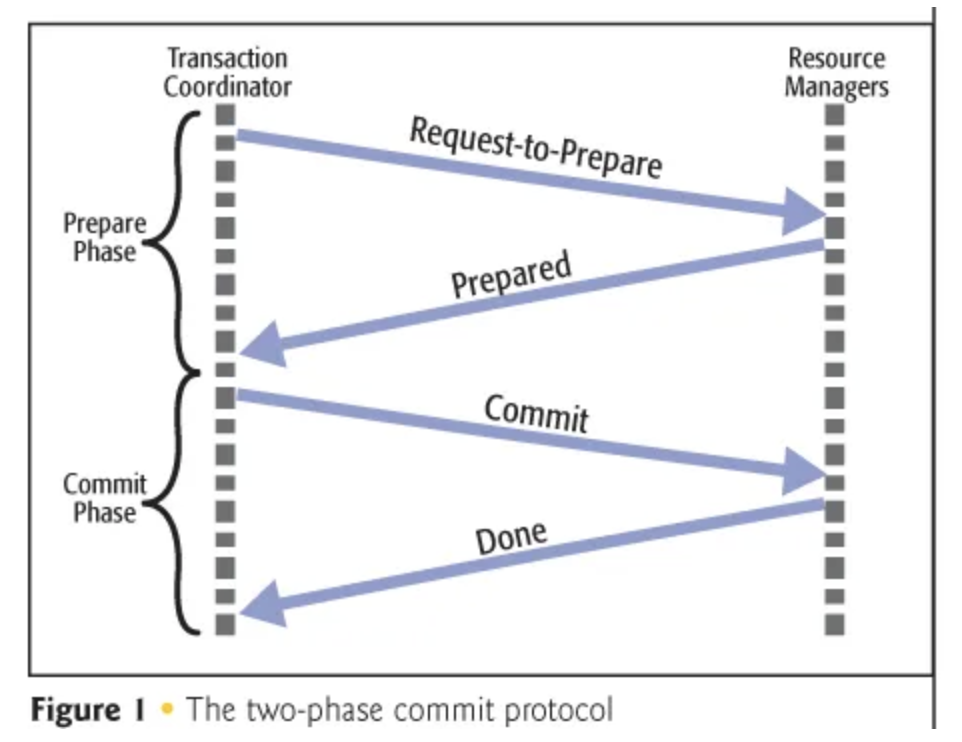

# MSA 형태 분리에 따른 트랜잭션 한계와 해결방안 

---

## 목차 
* [개요](#개요)
* [트랜잭션 범위 분석](#트랜잭션-범위-분석)
* [e-commerce 기존 트랜잭션](#e-commerce-기존-트랜잭션)
* [트랜잭션 처리의 한계](#트랜잭션-처리의-한계)
* [결론](#결론)

---

## 개요
마이크로서비스 아키텍처(MSA)로 시스템이 확장됨에 따라 서비스 간의 트랜잭션 관리가 기존의 단일 시스템과 다르게 동작하기 때문에 
MSA 환경에서 트랜잭션 처리의 한계를 정의하고, 이에 대한 해결 방안을 제시하고자 합니다.

## 트랜잭션 범위 분석 
### 트랜잭션이란?
- 데이터베이스의 상태를 변화시키기 위해 수행하는 작업의 단위
- ACID 특성을 만족해야 합니다.
    - **Atomicity(원자성)**: 트랜잭션의 모든 작업이 성공하거나 실패해야 한다.
    - **Consistency(일관성)**: 트랜잭션이 완료된 후 데이터베이스는 일관된 상태여야 한다.
    - **Isolation(독립성)**: 트랜잭션은 다른 트랜잭션에 영향을 받지 않아야 한다.
    - **Durability(지속성)**: 트랜잭션이 성공적으로 완료되면 그 결과는 영구적으로 반영되어야 한다.

### e-commerce 기존 트랜잭션
현재 구조에서는 모놀리식 아키텍처로 구성되어 있어 아래와 같은 기능을 제공합니다.
- 상품 결제
```java
상품_결제_transaction() {
    쿠폰_처리();
    포인트_사용();
    주문_상태_업데이트();
    결제_처리();
    데이터_플랫폼_전송();
}
```
- 주문 검증, 쿠폰 처리, 주문 상태 업데이트, 데이터 플랫폼 전송 등의 로직이 하나의 트랜잭션으로 묶여있습니다. 
- 모든 작업이 하나의 트랜잭션 안에서 이루어져 데드락이나 타임아웃 발생 가능성이 높습니다.
- 데이터 플랫폼 전송 실패 시 에러가 발생하지 않도록 따로 로직을 추가해야합니다. 
- 데이터 플랫폼 전송 로직이 결제 로직과 섞여 있어 관심사가 분리되지 않아 유지보수 및 가독성이 떨어집니다.
<br>

아래와 같이 Spring Event 를 사용하여 데이터 플랫폼 전송을 비동기로 처리할 수 있습니다. 
```java 
상품_결제_transaction() {
  쿠폰_처리();
    포인트_사용();
    주문_상태_업데이트();
    결제_처리_이벤트_발행();
}

@Async
@TransactionalEventListener(phase = TransactionPhase.AFTER_COMMIT)
데이터_플랫폼_전송(결제_처리_이벤트_발행) {
    try {
      데이터_플랫폼_전송();
    } catch (Exception e) {
      log.error("데이터 플랫폼 전송 실패: {}", e.getMessage());
    }
}
```
- `@Async` 어노테이션을 사용하여 비동기로 처리합니다.
    - 단일 애플리케이션에서는 Spring Event 를 사용하여 해결할 수 있지만, 서비스가 분리된 환경에서는 추가적인 메시지 브로커가 필요합니다.
    - 데이터 플랫폼 전송 로직을 별도의 메서드로 분리하여 **관심사를 분리**할 수 있습니다.
    - 메인 트랜잭션에서 데이터 플랫폼 전송을 제거하여 사용자 요청에 대한 응답 속도를 개선할 수 있습니다.
    - 이벤트 기반 구조로 변경하여 새로운 기능 추가 시 기존 코드를 수정할 필요 없이 확장 가능합니다.

## 서비스 분리 설계 및 트랜잭션 처리 방안
```java
상품_결제_transaction() {
    결제_정보_조회();
    결제_생성();
}

사용자_포인트_사용_transaction() {
    포인트_조회();
    포인트_사용();
}

쿠폰_처리_transaction() {
    쿠폰_조회();
    쿠폰_처리();
}

주문_상태_업데이트_transaction() {
    주문_상태_업데이트();    
}
```

## 트랜잭션 처리의 한계
- MSA에서는 각 도메인이 독립적으로 배포되므로, 하나의 작업이 여러 마이크로서비스에 걸쳐 이루어질 경우 일관성을 유지하기 어렵습니다.
- 마이크로서비스는 자체 데이터베이스를 관리하므로, 여러 서비스 간의 데이터 정합성을 유지하는 것이 어렵습니다. 
- 

## 해결방안 
### **2PC (Two-Phase Commit) 패턴**
  - 2PC 패턴은 분산 트랜잭션을 보장하기 위한 프로토콜로, 두 개의 단계(Prepare, Commit)로 나뉘어 트랜잭션을 처리합니다.
  - 2PC는 코디네이터와 여러 데이터베이스 간의 합의를 통해 트랜잭션 커밋/롤백이 결정됩니다.
  
  1. **Prepare(준비) 단계**
  - 트랜잭션 코디네이터(Coordinator)가 모든 관련 서비스(Participant)에게 트랜잭션을 수행할 준비가 되었는지 확인합니다.
  - 각 서비스는 준비가 되면 “Yes”를, 준비가 안 되었으면 “No”를 응답합니다.
  2. **Commit(커밋) 단계**
  - 모든 서비스가 “Yes”라고 응답하면, 트랜잭션을 최종 커밋합니다.
    하나라도 “No”라고 응답하면 전체 트랜잭션을 롤백합니다.
  - **장점** 
    - 강한 데이터 일관성을 유지할 수 있습니다.
    - 모든 서비스가 커밋을 확정한 후 실제 데이터를 변경하므로 데이터 정합성이 보장됩니다.
  - **단점**
    - 2PC는 코디네이터에 의존적이어서, 코디네이터 장애 시 모든 트랜잭션 참여자가 커밋/롤백 여부를 스스로 결정할 수 없다.
    - 참여자가 많아질수록 복잡도가 증가한다.
    - 블로킹 방식으로 동작하므로, 참여자 중 하나가 응답을 하지 않으면 전체 트랜잭션이 블로킹된다.
    - NoSQL 등 일부 DBMS가 지원하지 않으면 사용할 수 없다.

### **SAGA 패턴**
- 마이크로서비스들끼리 이벤트를 주고 받아 특정 마이크로서비스에서의 작업이 실패하면 이전까지의 작업이 완료된 마이크서비스들에게 보상 (complemetary) 이벤트를 소싱함으로써 분산 환경에서 원자성(atomicity)을 보장하는 패턴입니다.

#### 코레오그래피 기반 사가 (Choreography-based Saga) 
- **코레오그래피 (Choreography)** 는 각 서비스가 트랜잭션의 흐름을 자율적으로 관리하는 방식입니다.
- 트랜잭션의 각 단계에서 필요한 서비스가 이벤트를 발행하고, 이 이벤트를 다른 서비스가 구독하여 필요한 처리를 합니다.
- 장점 
  - 중앙 조정자가 없고, 각 서비스가 독립적으로 트랜잭션을 관리합니다.
- 단점
  - 각 서비스가 독립적으로 이벤트를 처리하므로, 전체 트랜잭션 흐름을 추적하기가 어려울 수 있습니다.
  - 이벤트 기반으로 연결된 서비스 중 하나가 실패할 경우, 복잡한 롤백 처리가 필요합니다.

#### 오케스트레이션 기반 사가 (Orchestration-based Saga)
- **오케스트레이션 (Orchestration)** 은 중앙 조정자(예: SAGA Coordinator)가 각 서비스의 트랜잭션 흐름을 중앙에서 관리하는 방식입니다. 
- SAGA Coordinator가 모든 트랜잭션을 관리하고, 각 서비스의 실행 순서를 지시합니다.
- 장점
  - 중앙 조정자가 모든 흐름을 관리하므로, 트랜잭션의 진행 상황을 추적하기가 쉬워집니다.
- 단점
  - 중앙 조정자의 역할이 커질수록 트랜잭션 병목이 발생할 가능성이 있습니다.
  - 모든 서비스가 중앙 조정자에 의존하므로, 결합도가 증가할 수 있습니다.

### 결론 
- 서비스 분리와 관련된 트랜잭션 관리는 시스템이 확장될수록 더욱 중요한 문제가 될 수 있습니다.
- `MSA(Microservices Architecture)`를 채택하여 도메인을 분리하고, `Kafka`를 활용한 이벤트 기반 아키텍처를 도입하고자 합니다.
- 이와 같은 방법은 e-commerce 시나리오에서 비즈니스 로직을 독립적이고 확장성을 보장할 수 있다고 생각합니다.
- 그러나 서로 통신하면서 발생하는 데이터 일관성 문제와 트랜잭션 관리 문제를 해결하기 위해 `SAGA 패턴`를 고려해야 하며, 보상 트랜잭션과 같은 방법을 통해 전체 시스템의 일관성을 유지해야 합니다.

### 참고 
- [Transaction ACID & Two Phase Commit](#https://medium.com/@inhyuck/transaction-acid-two-phase-commit-815356da33be)
- [[Architecture] MSA : SAGA 패턴이란](#https://azderica.github.io/01-architecture-msa/)