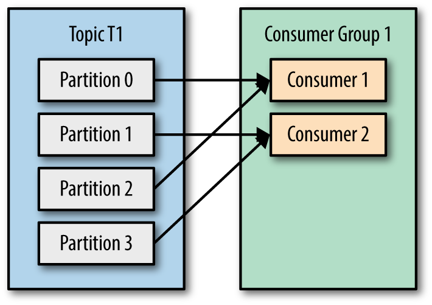
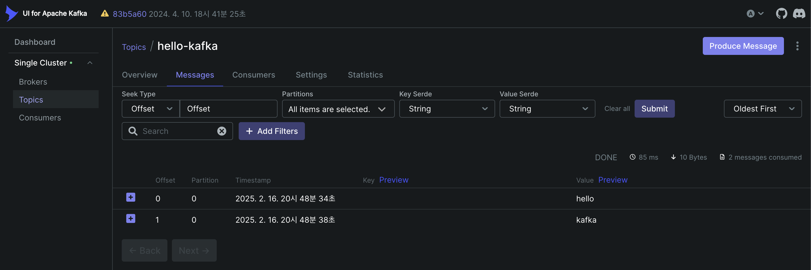

## Apache Kafka

---
## 목차
[1. 개요](#1.-개요)<br>
[2. 사용목적](#2.-사용목적)<br>
[3. 사용 이유](#3.-사용-이유)<br>
[4. 주요 용어](#4.-주요-용어)<br>
&emsp;&emsp;&emsp;&emsp;[4-1. Topic & Partition](#4-1.-Topic-&-Partition)<br>
&emsp;&emsp;&emsp;&emsp;[4-2. Producer & Consumer](#4-2.-Producer-&-Consumer)<br>
&emsp;&emsp;&emsp;&emsp;[4-3. Broker & Cluster](#4-3.-Broker-&-Cluster)<br>
&emsp;&emsp;&emsp;&emsp;[4-4. Zookeeper 의 역할](#4-4.-Zookeeper-의-역할)<br>
---

### 1. 개요
Apache Kafka는 **분산 스트리밍 플랫폼**으로, 실시간 데이터 처리 및 대규모 메시지 큐 시스템으로 널리 사용됩니다. 
Apache Kafka의 개념과 사용 목적, 그리고 Kafka가 필요한 이유와 주요 개념을 설명하고자 합니다.

### 2. 사용 목적 
Apache Kafka는 대량의 데이터를 빠르게 처리하고 비동기 방식으로 시스템 간 데이터를 전송하는 데 사용됩니다. 주로 다음과 같은 목적으로 활용됩니다.

- 비동기 메시징 시스템: 생산자(Producer)와 소비자(Consumer) 간 데이터를 효율적으로 전달 
- 실시간 데이터 스트리밍: 실시간으로 대량의 로그, 이벤트 데이터를 처리 
- 마이크로서비스 아키텍처 통합: 서비스 간 결합도를 낮추고 유연한 데이터 흐름을 제공 
- 로그 및 이벤트 수집: 대규모 분산 환경에서 시스템 로그를 중앙에서 관리 
- 데이터 파이프라인 구축: 데이터를 다양한 시스템으로 전달하는 데이터 허브 역할 수행

### 3. 사용 이유
Kafka는 기존의 메시지 큐 시스템(RabbitMQ, ActiveMQ 등)과 비교하여 다음과 같은 장점을 갖습니다.
- 고성능 처리: 초당 수백만 건 이상의 메시지를 처리 가능 
- 확장성(Scalability): 여러 개의 브로커(Broker)로 확장이 용이
- 내결함성(Fault Tolerance): 데이터 복제(Replication)를 통해 장애 발생 시에도 데이터 손실 방지 
- 비동기 처리 지원: 생산자와 소비자가 독립적으로 동작하여 서비스 간 결합도를 낮춤 
- 지속적인 데이터 저장: 로그 기반 저장 방식으로 데이터를 재처리 가능

### 4. 주요 용어
### 4-1. Topic & Partition 

- `Topic` : Kafka에서 데이터를 분류하는 단위로, 특정 주제에 해당하는 메시지 스트림을 관리합니다.
- `Partition` : 토픽을 분할하여 여러 개의 브로커에 분산 저장할 수 있도록 합니다.
  - 대용량 트래픽을 **파티션의 개수만큼 병렬로 처리**할 수 있어 빠른 처리 가능합니다.
  - 전체 메세지의 발행 순차처리를 보장하지 않지만, **같은 파티션의 메세지에 대해서는 순차처리**를 보장합니다.

### 4-2. Producer & Consumer

- `Producer` : 메세지를 카프카 브로커에 적재(발행)하는 서비스입니다.
- `Consumer` : 카프카 브로커에 적재된 메시지를 읽어오는(소비) 서비스입니다.
- `Consumer Group` : 여러 개의 컨슈머(Consumer)들이 협력하여 토픽의 데이터를 병렬로 처리할 수 있도록 도와주는 개념입니다.

### 4-3. Broker & Cluster

- `Broker` : 카프카 서버 Unit 으로 Producer의 메세지를 받아 offset 지정 후 디스크에 저장합니다.
- `Cluster` : 여러 개의 브로커가 모여서 하나의 클러스터를 구성하여 확장성과 내결함성을 제공합니다.

### 4-4. Zookeeper 의 역할

- Kafka는 Zookeeper를 이용하여 브로커의 상태를 관리하고, 파티션 리더를 선출하는 등의 작업을 수행합니다.
- 장애 발생 시 새로운 리더를 자동으로 할당하여 클러스터의 안정성을 유지합니다.

### 5. 카프카(Kafka) 서버 구축
### 5-1. 카프카(Kafka) 다운로드
  [Apache Kafka 다운로드 공식 홈페이지](https://kafka.apache.org/downloads) 에서 Kafka 를 다운로드 합니다.
### 5-2 Kafka Zookeeper 구동
   현재 위치에서 bin 폴더에 존재하는 zookeeper-server-start.sh 쉘 커맨드를 구동하는데 이때, 
   config 폴더에 존재하는 zookeepr.properties 설정 파일을 참조g합니다.
  ```
  ./bin/zookeeper-server-start.sh ./config/zookeeper.properties
  ```
### 5-3. Kafka Broker 구동
   💡 주의할 점은 Zookeeper 서버가 구동된 상태일때만 Kafka Broker 구동이 가능합니다.
  ```
  ./bin/kafka-server-start.sh ./config/server.properties
  ```
### 5-4. Docker 을 이용한 카프카 서버 구축
1. 어플리케이션 빌드
    ```
   [1번 터미널]$ ./gradlew clean build
    ```
2. 카프카를 포함한 컨테이너 실행
    ```
    [1번 터미널]$ docker-compose -f docker-compose.yml up
    ```
3. 카프카 터미널 접속
    ```
    [2번 터미널]$ docker run --rm -it --network server-java_default confluentinc/cp-kafka:7.5.4 bash
    ```
4. 카프카 토픽 생성 및 확인
   ```
   [2번 터미널]$ kafka-topics --create --bootstrap-server kafka:9092 --topic hello-kafka
   [2번 터미널]$ kafka-topics --list --bootstrap-server kafka:9092
   ```

5. 메시지 생성 준비
   ```
   [2번 터미널]$ kafka-console-producer --broker-list kafka:9092 --topic hello-kafka
   ```

6. 메시지 소비 준비
   ```
   [3번 터미널]$ docker run --rm -it --network server-java_default confluentinc/cp-kafka:7.5.4 bash
   [3번 터미널]$ kafka-console-consumer --bootstrap-server kafka:9092 --topic hello-kafka --from-beginning
   ```

7. 메시지 출력 확인

   2번 터미널에서 메시지를 입력하면 3번 터미널에서 해당 메시지들이 순차적으로 출력되는 것을 확인할 수 있습니다.
   ```
   [2번 터미널]
   hello
   kafka
   [3번 터미널]
   hello
   kafka
   ```
   