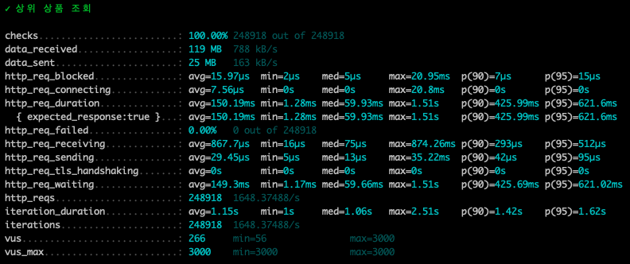
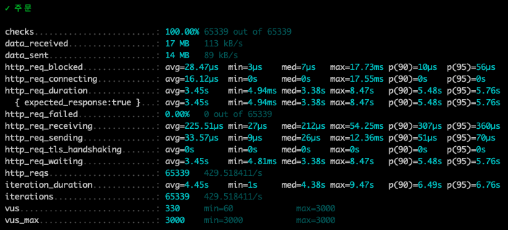

## API 부하 테스트 분석에 대한 보고서

---
## 목차
[1. 개요](#1.-개요)<br>
[2. 테스트 목적](#2.-테스트-목적)<br>
[3. 테스트 도구 및 방법론](#3.-테스트-도구-및-방법론)<br>
&emsp;&emsp;&emsp;&emsp;[3.1 테스트 도구](#3.1-테스트-도구)<br>
&emsp;&emsp;&emsp;&emsp;[3.2 테스트 시나리오](#3.2-테스트-시나리오)<br>
&emsp;&emsp;&emsp;&emsp;[3.3 테스트 설정](#3.3-테스트-설정)<br>
[4. API 테스트](#4.-API-테스트)<br>
&emsp;&emsp;&emsp;&emsp;[4.1 상위 상품 조회 API](#4.1-상위-상품-조회-API)<br>
&emsp;&emsp;&emsp;&emsp;[4.2 주문 API](#4.2-주문-API)<br>
[5. 종합 평가 및 결론](#5.-종합-평가-및-결론)<br>
&emsp;&emsp;&emsp;&emsp;[5.1 전체 시스템 성능 요약](#5.1-전체-시스템-성능-요약)<br>
&emsp;&emsp;&emsp;&emsp;[5.2 주요 강점](#5.2-주요-강점)<br>
&emsp;&emsp;&emsp;&emsp;[5.3 개선 영역](#5.3-개선-영역)<br>
&emsp;&emsp;&emsp;&emsp;[5.4 최종 결론](#5.4-최종-결론)<br>


---

### 1. 개요 
개발 프로젝트가 거의 완료되었을 때, 배포 준비 상태를 파악하는 데 필수적인 테스트 중 하나가 부하 테스트입니다.
부하 테스트란 **시스템이 처리할 수 있는 임계값 한계에 도달할 때까지 부하를 지속적으로 증가시키면서 성능을 평가하는 테스트**를 의미합니다.<br>
본 보고서는 e-commerce 서비스 API에 대한 부하 테스트 결과를 상세히 기술하며,
테스트의 주요 목적은 API의 성능, 안정성, 확장성 평가 및 잠재적인 병목 현상 식별입니다. <br>
또한, 부하 테스트를 통해 실제 운영 환경에서의 시스템 대응 능력을 검증하고,
최적화 및 개선이 필요한 영역을 도출하여 보다 안정적인 서비스를 제공하는 데 기여하고자 합니다.

### 2. 테스트 목적
- 시스템이 예상되는 부하를 정상적으로 처리할 수 있는지 평가합니다.
- 일시적인 높은 부하 상황에서의 시스템 성능 파악합니다.
- 장애 상황 시뮬레이션을 통한 문제점 분석 및 개선 방안 도출합니다.
- 적정한 애플리케이션 배포 스펙 결정을 위한 데이터 수집합니다.

### 3. 테스트 도구 및 방법론
### 3.1 테스트 도구
- k6 : Go로 작성된 오픈 소스 부하 테스트 도구이며 주요 특징은 아래와 같습니다.

- JavaScript를 사용하여 테스트 스크립트 작성
- 다양한 프로토콜 지원 (HTTP, WebSocket, gRPC 등)
- 확장 가능한 메트릭 시스템
- 클라우드 서비스와의 통합 지원
- 실시간 모니터링 및 결과 분석 기능

이러한 특징들로 인해 k6는 복잡한 시나리오를 시뮬레이션하고 다양한 각도에서 시스템 성능을 평가하는 데 적합하다고 판단하였습니다.

### 3.2 테스트 시나리오
- 2 가지 주요 시나리오로 테스트를 진행하였습니다.
<br><br>
- Load Test (부하 테스트)
  - 목적: 시스템이 예상되는 일반적인 부하를 정상적으로 처리할 수 있는지 평가
  - 방법: 특정 부하를 제한된 시간 동안 제공하여 시스템의 안정성 확인
  - 중요성: 일상적인 운영 상황에서의 시스템 성능을 확인하고, 리소스 사용량을 예측하는 데 도움


- Peak Test (최고 부하 테스트)
  - 목적: 시스템이 일시적으로 높은 부하를 처리할 수 있는지 평가
  - 방법: 목표 임계 부하를 순간적으로 제공하여 시스템의 대응 능력 확인
  - 중요성: 특별 이벤트나 예상치 못한 트래픽 급증 상황에서의 시스템 안정성 확인

### 3.3 테스트 설정
- 테스트는 아래와 같이 진행합니다.
- 부하 테스트 (Load Test)
  - 0초~10초: 0에서 1000명으로 가상 사용자 증가
  - 10초~20초: 1000명에서 2000명으로 증가
  - 20초~30초: 2000명에서 3000명으로 증가
  - 30초~40초: 3000명에서 2000명으로 감소 (유지)
  - 40초~50초: 2000명에서 1000명으로 감소 (유지)
<br><br>
  
- 최고 부하 테스트 (Peak Test)
  - 0초~30초: 0에서 3000명으로 가상 사용자 급증
  - 30초~40초: 3000명의 가상 사용자 유지
  - 40초~50초: 3000명에서 2000명으로 감소
  - 50초~60초: 2000명에서 1000명으로 감소
  - 60초~70초: 1000명에서 0명으로 감소
<br><br>
- 점진적으로 부하를 증가시키는 것과 최대 트래픽이 발생하는 상황을 통해 다양한 시니리오를 통해 시스템의 성능을 평가합니다.
- 이로써 시스템의 성능 한계를 파악하고, 잠재적인 병목 지점을 식별하는 데 도움이 될 것이라고 생각합니다.

## 4. API 테스트
### 4.1 상위 상품 조회 API
```javascript
import http from 'k6/http';
import { check, sleep } from 'k6';

export const options = {
    stages: [
        { duration: '10s', target: 1000 },
        { duration: '20s', target: 2000 },
        { duration: '30s', target: 3000 },
        { duration: '40s', target: 2000 },
        { duration: '50s', target: 1000 },
    ],
}

export default function () {

    const DEFAULT_URL = 'http://localhost:8080';
    const userId = 1;

    const params = {
        headers: { 'Content-Type': 'application/json', }
    }

    const response = http.get(`${DEFAULT_URL}/api/v1/products/top`, null, params);
    check(response, { '상위 상품 조회': (res) => res.status === 200 });

    sleep(1);
}
```

#### 4.1.1 결과


#### 4.1.2 분석
- 성공률: 모든 요청이 100% 성공률로 처리되었습니다.
- 처리량
  - 초당 약 1,648개의 요청을 처리했습니다.
  - 총 248,918개의 요청이 처리되었습니다.

- 응답 시간
  - 평균 응답 시간: 150.19ms
  - 중간값 응답 시간: 59.93ms
  - 90번째 백분위 응답 시간: 425.99ms
  - 95번째 백분위 응답 시간: 621.6ms

- 에러율은 0% 로 모든 요청이 성공적으로 처리되었습니다.
- 동시 사용자: 최대 3,500명의 가상 사용자(VU)가 동시에 테스트를 수행했습니다.
- 네트워크 지연:
  - 요청 차단 시간 (avg): 15.97µs
  - 연결 시간 (avg): 7.56µs
- 데이터 전송
  - 받은 데이터: 119MB (788 kB/s)
  - 보낸 데이터: 25MB (163 kB/s)
<br><br>
#### 4.1.3 테스트 분석 결론
- 상위 상품 조회 API 는 높은 부하 상황에서도 안정적으로 작동했습니다.
- 모든 요청이 성공적으로 처리되었으며, 평균 응답 시간이 150.19ms로 비교적 안정적인 수준을 유지했습니다.
- 그러나 95번째 백분위 응답 시간이 621.6ms로 상당히 높아, 일부 요청에서 지연이 발생할 가능성이 있습니다.
- 시스템이 초당 1,648개의 요청을 처리할 수 있음을 확인했으며, 동시 사용자 수가 최대 3,000명까지 증가해도 정상적으로 응답했습니다.
- 다만, 높은 부하 상황에서 일부 요청의 응답 시간이 증가하는 현상이 발생하므로 최적화 및 지연 원인 분석이 필요합니다.
  <br><br>
### 4.2 주문 API
```javascript
import http from 'k6/http';
import { check, sleep } from 'k6';

export const options = {
    stages: [
        { duration: '10s', target: 1000 },
        { duration: '20s', target: 2000 },
        { duration: '30s', target: 3000 },
        { duration: '40s', target: 2000 },
        { duration: '50s', target: 1000 },
    ],
}

export default function () {

    const DEFAULT_URL = 'http://localhost:8080';
    const userId = 1;

    const params = {
        headers: { 'Content-Type': 'application/json', }
    }

    const payload = JSON.stringify({
        orderProductList: [
            {
                productId: 1,
                quantity: 1
            }
        ]
    });

    const response = http.post(`${DEFAULT_URL}/api/v1/orders?userId=${userId}`, payload, params);
    check(response, { '주문': (res) => res.status === 200 });

    sleep(1);
}
```

#### 4.2.1 결과


#### 4.2.2 분석
- 성공률: 모든 요청이 100% 성공률로 처리되었습니다.
- 처리량
  - 초당 약 429개의 요청을 처리했습니다. 
  - 총 65,339개의 요청이 처리되었습니다.
  
- 응답 시간 
  - 평균 응답 시간: 3.45s
  - 중간값 응답 시간: 3.38s
  - 90번째 백분위 응답 시간: 5.48s
  - 95번째 백분위 응답 시간: 5.76s
  - 응답 시간이 비교적 길어, 성능 최적화가 필요해 보입니다.
- 에러율은 0%로, 모든 요청이 성공적으로 처리되었습니다.
- 동시 사용자: 최대 3,000명의 가상 사용자(VU)가 동시에 테스트를 수행했습니다.
- 최소 60명, 평균적으로 330명이 동시 접속했습니다.
- 네트워크 지연 
  - 요청 차단 시간 (avg): 28.47µs 
  - 연결 시간 (avg): 16.12µs
- 데이터 전송 
  - 받은 데이터: 17MB (113 kB/s)
  - 보낸 데이터: 14MB (89 kB/s)

#### 4.2.3 테스트 분석 결론
- 높은 부하 상황에서도 모든 요청을 성공적으로 처리했습니다. 
- 응답 시간이 평균 3.45초로 매우 높은 수준입니다. 
- 특히 90번째 및 95번째 백분위 응답 시간이 5초 이상으로, 부하가 증가할 경우 대기 시간이 더욱 증가할 가능성이 있습니다.
- 시스템 최적화를 통해 응답 시간을 단축할 필요가 있으며, 주문 요청 처리 방식 개선 및 비동기 처리 도입을 고려해야 합니다.
<br><br>
### 5. 종합 평가 및 결론
#### 5.1 전체 시스템 성능 요약
1. **안정성**: 모든 테스트에서 100% 성공률을 기록하며, 시스템이 높은 부하 상황에서도 안정적으로 작동했습니다.
2. **확장성**: 최대 3,000명의 동시 사용자를 지원하며, 높은 트래픽 환경에서도 일정 수준 이상의 성능을 유지했습니다.
3. **응답성**: 상위 상품 조회 API 는 밀리초 단위의 빠른 응답 속도를 보였으나, 주문 API의 경우 평균 3.45초로 상대적으로 긴 응답 시간을 기록했습니다.
4. **일관성**: 상위 상품 조회 API 는 안정적인 응답 속도를 유지했지만, 주문 API에서는 높은 백분위 응답 시간이 관찰되며 성능 변동성이 존재했습니다.
5. **처리량**: 초당 429 ~ 1,648개의 요청을 처리하며, 높은 동시 접속 환경에서도 원활한 트랜잭션 처리가 가능했습니다.

#### 5.2 주요 강점
1. **효율적인 캐싱 활용**: 일부 API 는 캐싱을 효과적으로 활용하여 빠른 응답 시간을 유지했습니다.
2. **높은 성공률**: 모든 API에서 0%의 에러율을 기록하며, 안정적인 서비스 운영이 가능했습니다.
3. **동시 요청 처리 능력**: 최대 3,000명의 동시 사용자 환경에서도 요청을 안정적으로 처리했습니다.
4. **견고한 데이터 전송 처리**: 테스트 결과, 요청 및 응답 데이터 전송 속도가 일정하게 유지되었습니다.

#### 5.3 개선 영역
- **응답 시간 개선**: 주문 API의 평균 응답 시간이 3.45초로 다소 길어, 이를 최적화할 필요가 있습니다.
- **응답 시간 변동성 최소화**: 95번째 백분위 응답 시간이 높은 API가 있어, 성능 변동성을 줄이기 위한 개선이 필요합니다.
- **부하 분산 전략 보강**: 피크 트래픽 상황에서 더욱 안정적인 성능을 유지하기 위해 부하 분산 전략을 강화할 필요가 있습니다.

#### 5.4 최종 결론
- 전체 시스템은 높은 부하 상황에서도 안정적으로 작동하며, 대부분의 API가 빠른 응답 속도를 유지했습니다. 
- 주문 API 에서 응답 시간이 길어지는 문제가 있지만, 이를 해결하면 더욱 효율적인 시스템 운영이 가능할 것으로 예상됩니다. 
- 캐싱 전략과 동시 요청 처리 성능이 우수하여, 높은 트래픽 상황에서도 원활한 서비스를 제공할 수 있을 것으로 예상됩니다. 
- 종합적으로, e-commerce 시스템은 높은 트래픽과 복잡한 트랜잭션을 처리할 수 있는 안정적이고 확장 가능한 구조를 갖추고 있습니다.